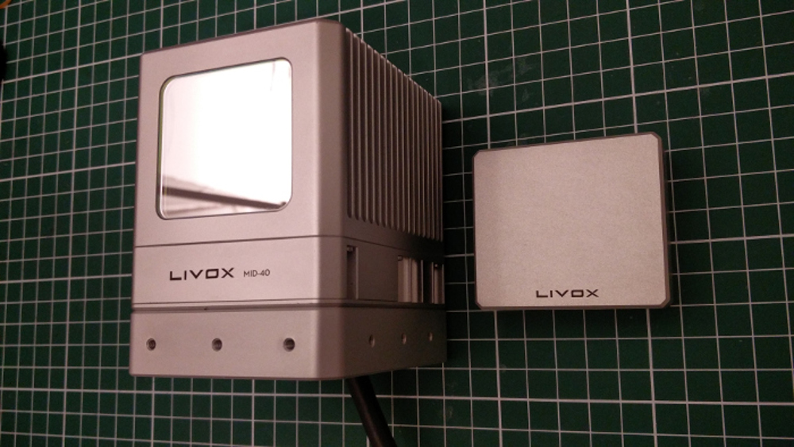
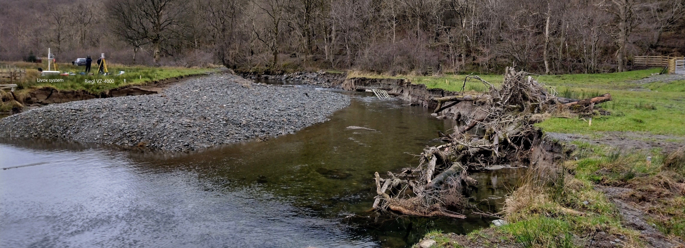

 
  

<h1 align="center"> Livox Mid-40 </h1>
<h3 align="center"> Data acquisition and processing </h3>  

 

<!-- TABLE OF CONTENTS -->
<h2 id="table-of-contents"> :book: Table of Contents</h2>

  
Table of Contents

  <ol>
    <li><a href="#about-the-project"> ➤ About The Project</a></li>
    <li><a href="#prerequisites"> ➤ Prerequisites</a></li>
    <li><a href="#Repository Structure"> ➤ Repository Structure</a></li>
    <li><a href="#How to use"> ➤ How to use</a></li>

<!-- ABOUT THE PROJECT -->
<h2 id="about-the-project"> :pencil: About The Project</h2>

 
This project seeks to develop a workflow for ingesting data acquired by Livox Mid-40 LiDAR systems for automated acquisition of 3D topographic data which can be used to determine geomorphic change. This repository is split into three sections, namely: i) code used to generate figures present within the research article "An evaluation of low-cost terrestrial LiDAR sensors for assessing geomorphic change"; ii) code used to interface with the Livox Mid-40 LiDAR sensors using a Fitlet 2 operating in Windows and; iii) code used to process the raw data acquired by the Livox sensors. 

<!-- PREREQUISITES -->
<h2 id="prerequisites"> :fork_and_knife: Prerequisites</h2>

**Replicating the outputs** presented in "An evaluation of low-cost terrestrial LiDAR sensors for assessing geomorphic change" requires the user to download the data files from: https://data.ncl.ac.uk/articles/dataset/Data_for_output_replication/23501091/2, the code from this GitHub repository, and to be able to run MATLAB 2019a onwards. If the user wishes to re-process the Livox data they will also need to download the converted raw data from: https://www.dropbox.com/sh/0x3zrgdzbtncjed/AACWkr69x_NbNSZW8kF75FBka?dl=0 or https://hidrive.ionos.com/share/7a01joszlq
  
**Processing of the acquired raw data** is currently undertaken through two routes:
* Files within the "ros" subfolder are executed in a Linux docker container. This container should be configured to work with the Robot Operating System (ROS). The "cloud_calls.py" script assumes that data to be converted is stored within an Amazon S3 bucket with the converted data being uploaded back to the S3 service. S3cmd is required for this operation. This script is provided as an example and could be modified for your own individual case. This process has already been conducted on the converted raw data presented in https://www.dropbox.com/sh/0x3zrgdzbtncjed/AACWkr69x_NbNSZW8kF75FBka?dl=0, and https://hidrive.ionos.com/share/7a01joszlq
* Files within the "scan" subfolder are executed using MATLAB 2019a onwards to split, align, and re-merge the Livox data. To begin this process, execute "parsing_pcd.m" esnuring that you have modified the input variables accordingly.
    
**Interfacing with the Livox sensor** is currently achieved using a Livox Hub connected to a x64-based Windows 10 PC. Scripts required for this are found in the "interfacing" folder. This has the following dependencies:
* Python 3.10.*
* pyserial (if using accelerometer): python -m pip install pyserial
* pandas: pip install pandas
* livox sdk: https://github.com/Livox-SDK/Livox-SDK - this needs to be compiled from source

<!-- Repository Structure -->
<h2 id="Repository Structure"> :cactus: Repository Structure</h2>

 
  
Below is the an outline of the folder structure within this repository with descriptions provided:

    .
    ├── code                    # folder containing scripts to work with the livox mid-40 scanners
    │   ├── fig1                # schematic diagram presented in Figure 1
    │   ├── fig3                # scripts required to generate outputs presented in Figure 3
    │   ├── fig4                # scripts required to generate outputs presented in Figure 4
    │   ├── fig5                # scripts required to generate outputs presented in Figure 5
    │   ├── fig6                # scripts required to generate outputs presented in Figure 6	
    │   ├── fig7                # scripts required to generate outputs presented in Figure 7
    │   ├── fig8                # scripts required to generate outputs presented in Figure 8
    │   ├── fig9                # scripts required to generate outputs presented in Figure 9
    │   ├── interfacing         # scripts required to interface with mid-40 using a Fitlet 2 (on Windows)
    │   ├── processing          # scripts for data processing
    │   │   │── ros             # scripts for data conversion from lvx to pcd
    │   │   │── scan            # scripts for generating outputs from raw (.pcd) data
    ├── images                  # folder containing images 
 
  

  
<!-- How to use -->
<h2 id="How to use"> 👍 How to use</h2>

 
    
1. If you are primarily interested in **replicating the outcomes** of "An evaluation of low-cost terrestrial LiDAR sensors for assessing geomorphic change", without re-processing the data follow these steps:
* Clone or download this repository so that it is accessible on your PC.
* Download the files from: https://data.ncl.ac.uk/articles/dataset/Data_for_output_replication/23501091/2 to your PC.  
* Open MATLAB on your PC.
* To generate Figure 3, run flowCharts.tex from your latex compiling software
* To generate Figure 4, ensure all scripts in "fig4" subfolder are accesible in your MATLAB search path, execute "densityPlot.m", ensuring that you provide the links to the directories containing the relevant datasets (downloaded from Step 2 above).
* To generate Figure 5, ensure all scripts in "fig5" subfolder are accesible in your MATLAB search path, execute "master_fcn_fig5.m", ensuring that you provide the links to the directories containing the relevant datasets (downloaded from Step 2 above).
* To generate Figure 6, ensure all scripts in "fig6" subfolder are accesible in your MATLAB search path, execute "cloud_comparisons.m", ensuring that you provide the links to the directories containing the relevant datasets (downloaded from Step 2 above).
* To generate Figure 7, ensure all scripts in "fig7" subfolders are accesible in your MATLAB search path, execute "cdf_plots.m", ensuring that you provide the links to the directories containing the relevant datasets (downloaded from Step 2 above). 
* To generate Figure 8, ensure all scripts in "fig8" subfolders are accesible in your MATLAB search path, execute "plotGaugingData.m", ensuring that you provide the links to the directories containing the relevant datasets (downloaded from Step 2 above).
* To generate Figure 9, ensure all scripts in "fig9" subfolders are accesible in your MATLAB search path, execute "long_transect_bank_retreat.m", ensuring that you provide the links to the directories containing the relevant datasets (downloaded from Step 2 above).
  
2. If you are interested in **re-processing the raw data** to generate the outputs stored at: https://data.ncl.ac.uk/articles/dataset/Data_for_output_replication/23501091/2, follow these steps:
* Clone or download this repository so that it is accessible on your PC.
* Download the files from  https://www.dropbox.com/sh/0x3zrgdzbtncjed/AACWkr69x_NbNSZW8kF75FBka?dl=0 or https://hidrive.ionos.com/share/7a01joszlq to your PC.  
* Open MATLAB on your PC.
* Run "parsing_pcd.m", ensuring that you define the input and output variables. This script initially loads the Livox data for each epoch and splits it into data acquired from scanner01 and scanner02 based on the scanner return data (using "splittingLivox.m"). Subsequently, the data from scanner01 is aligned to scanner02 for each epoch. This is initially achieved through an initial coarse transformation to get the data approximately aligned, before ICP analysis is conducted (in "initial_icp_alignment.m"). This generates a merged scan containing data from both scanner01 and scanner02 for each epoch. Next, this merged dataset is aligned back to a reference scan undertaken on 29th Jan 2022 (in "tree_alignment.m"). 
* Following succesful execution of "parsing_pcd.m", your processed Livox data will be stored within the "processed_dir". Now that we have this processed data we can perform analysis on these datasets.
* To generate Figure 8 data and outputs, first run the script "visualiseCloud.m". Ensure that you provide the correct path to the "processed_dir" which contains the aligned/merged point clouds (generate in the previous step). Following this, run "plotGaugingData.m", ensuring you define the location where the outputs from "visualiseCloud.m" are stored, along with the "Goldrill_level_data.xlsx" from: https://data.ncl.ac.uk/articles/dataset/Data_for_output_replication/23501091/2.  
* To generate Figure 9 data and outputs, first run the script "section_anlaysis.m".  You will need to run this for each cross-section of interest. In the article, we present data for cross-sections: 10,14,20,24. Upon the script being run for each cross-section an output .mat file will be saved containing the data for the given cross-section between 18th and 25th February 2022. This .mat file is the same as that which is present within "cross_section_outputs.7z" in the data repository at: https://data.ncl.ac.uk/articles/dataset/Data_for_output_replication/23501091/2.
* Upon creation of the cross-section datasets, you can execute "long_transect_bank_retreat.m", ensuring you provide the correct path to where the cross-section data is saved.

3. If you are interested in **generating data with a Livox sensor**, the following steps may help:
* Establish a Livox system connected to the PC via ethernet cable.
* Compile the Livox SDK on the PC using the files and instructions at: https://github.com/Livox-SDK/Livox-SDK
* Execute the "livox_call.py" python script within the "interfacing" folder. First you will need to edit this to provide the correct path to Livox SDK (lines 57, 66), and provide an appropriate path for the data to be stored (line 98-99). This script is designed to be executed upon startup (Task Scheduler), following which the data will collected and uploaded (to AWS S3 if configured), before shutting down the PC. If you do not want the PC to be shutdown on data acquisition, remove line 90.
* Upon succesful acquisition of the data from the Livox LiDAR system, a .lvx file will be saved to your data folder. In order to use this, we need to convert it to a different format. In this example, we convert it to a .pcd file. This is achieved using the Robot Operating System (ROS). In order to undertake this conversion, we establish a Docker container (Linux) and install the ROS. Upon configuration, we are able to run "cloud_calls.py" from the "processing" folder. This downloads the raw .lvx data from an AWS S3 container (needs to be configured), converts the file to a .ros and .pcd before uploading the new files back to AWS S3. This will need to be modified (naming of the buckets) for your own uses and we assume that s3cmd is configured to deal with data transfers.
  
  

  
 
  
  

  
 
  View looking upstream at the Goldrill Beck monitoring site. Shown in the image are the Livox monitoring system, and Riegl VZ-4000 acquiring validation data.
  

  
